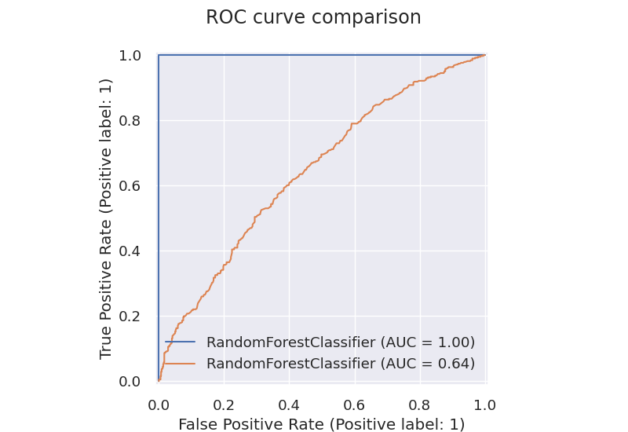

# Model Deployment with FastAPI
## Project description
In this project I built a Random Forest Classification model that predicts wether the water is potable or not based on the next 9 variables:
- **ph**
- **Hardness**
- **Solids**
- **Chloramines**
- **Sulfate**
- **Conductivity**
- **Organic_carbon**
- **Trihalomethanes**
- **Turbidity**
  
This model is deployed with FastAPI on a local server and it uses Uvicorn to allow the API to comunicate with the server.

## Methods used
- Data visualization
- Data preparation
- Model training
- Model evaluation
- Model deployment with API 

## Technologies
- <ins>**Data Preparation**</ins>: funpymodeling and pandas.
- <ins>**Model Training**</ins>: sklearn.
- <ins>**Data Visualization**</ins>: seaborn, matplotlib and yellowbrick.
- <ins>**API**</ins>: FastAPI, uvicorn, pydantic, and requests.
- <ins>**Others**</ins>: numpy and pickles.

## Installation
### Docker
1. Create image:  
`docker build -t proyecto_bootcamp_edvai_jueves .`

2. Create container:  
`docker run -p 5000:8000 -e ID_USER=Iñaki proyecto_bootcamp_edvai_jueves` 

### Without Docker 
1. Clone the repository:  
`git clone https://github.com/ITRoselloSignoris/Data-Science-Model-Deployment-`

2. Install the necessary libraries inside the requirements.txt:  
`pip install -r requirements.txt`

3. Run the "main.py" file to comunicate with the web server:  
`python main.py`

4. Run the "call_api.py" file to call the api:   
`python call_api.py` 

## Results
### Confusion Matrix
  
As you can see, the model has a 100% accuracy, so we can deduce that the model does not do a generalization of the data, instead it learns the expected output for the values given.  
This tells us that this model is **overfitting**, so we need to tune it.

### Discrimination Threshold

Here we can see how metrics like precision, recall and f1 change with different threshold values.
### ROC curve
  
As we saw in the ***confusion matrix***, in the ***ROC curve*** we can see that the model learned perfectly the training data.  
It was supposed to find a pattern in the data, however it did not find it, so that is why the model performs significantly worse for the testing data.
## To-Do list
- [X] Make and save model's validation error plots.
- [X] Add ROC curve and Confusion Matrix plots in the README.md file.
- [ ] Add information about the process of the doing the model (data preparation, model chosen, parameters, etc)
- [X] Save discretized bins, and use it in the **predict_water_potability** function inside the API.
